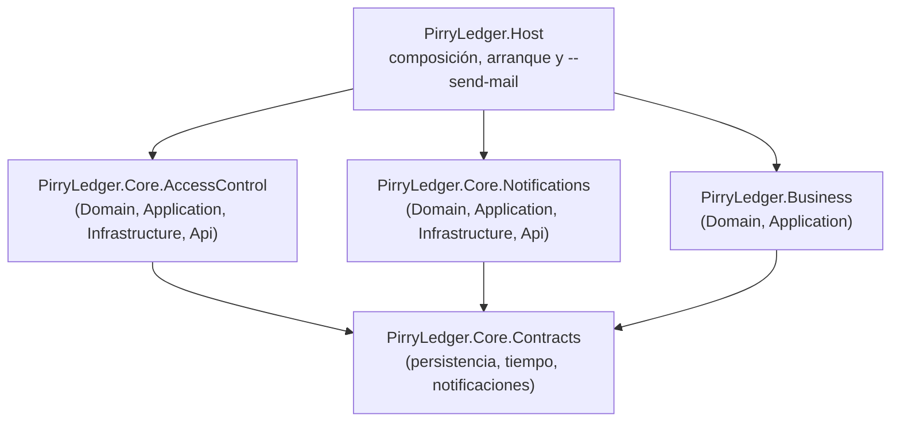
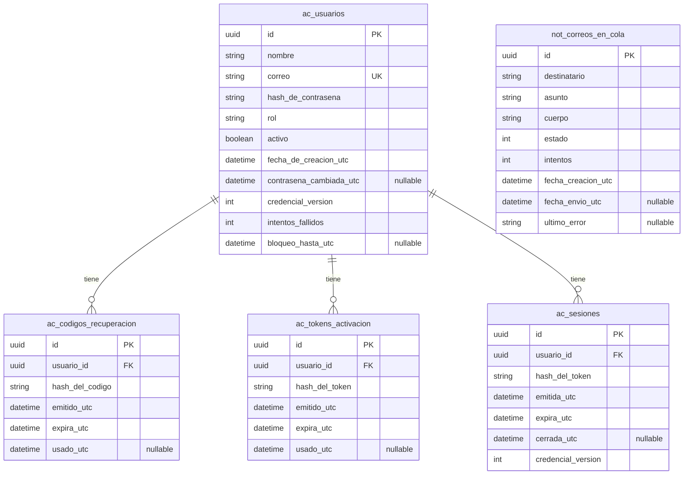

# Pirry Ledger

ERP para un negocio de comida rápida. Práctica 1 — Control de acceso.

En este punto el repositorio tiene la cola de correo con su persistencia y un
comando para enviar lo pendiente. La API expone el registro con activación, el
inicio de sesión con su tabla de sesiones, la recuperación de contraseña y la
administración de usuarios. El módulo Business contiene la estructura de la
máquina de estados de `Invoice`; sus pruebas quedan para la semana 8.

Este README está ordenado como se usa:

| # | Sección | Para qué |
|---|---|---|
| 1 | [Cómo correr el proyecto](#1-cómo-correr-el-proyecto) | De cero a la API levantada y verificada. |
| 2 | [Qué es y cómo está hecho](#2-qué-es-y-cómo-está-hecho) | Arquitectura, estructura y decisiones. |
| 3 | [Cómo probar cada criterio de aceptación](#3-cómo-probar-cada-criterio-de-aceptación) | Las pruebas, una por requisito. |
| 4 | [Referencia](#4-referencia) | Endpoints, base de datos y alcance. |

---

## 1. Cómo correr el proyecto

Todos los comandos están escritos para PowerShell en Windows. Sigue los pasos
en orden solo la primera vez; después, los pasos 5 a 8 son los que se repiten.

### Requisitos

- .NET SDK `10.0.302`. La versión exacta la fija `global.json`, no hace falta
  instalar nada más.
- PostgreSQL 18, con una base `pirry_ledger` y un rol que sea dueño de ella.
- Git.
- La herramienta global `dotnet-ef` `10.0.12`, solo para aplicar las
  migraciones.

Los proyectos de infraestructura ya incluyen el paquete
`Microsoft.EntityFrameworkCore.Design`, que permite que `dotnet ef` cree y
ejecute el contexto de diseño de cada módulo. No tienes que instalarlo a mano:
`dotnet restore` lo descarga desde los `.csproj`. La herramienta global
`dotnet-ef` y el paquete `Design` son cosas distintas y se necesitan ambas para
trabajar con las migraciones.

El Host además usa el paquete `DotNetEnv` para leer el archivo `.env` del paso
4. Tampoco hay que instalarlo a mano: `dotnet restore` (y el propio
`dotnet run`) lo baja desde `PirryLedger.Host.csproj`.

### Paso 1: instalar las herramientas

Instala .NET SDK `10.0.302`, PostgreSQL 18 y Git. Después instala la herramienta
de Entity Framework una sola vez por usuario de Windows:

```powershell
dotnet tool install --global dotnet-ef --version 10.0.12
dotnet --version
dotnet ef --version
```

Debes obtener .NET `10.0.302` y Entity Framework `10.0.12`. Si `dotnet ef` ya
responde `10.0.12`, no vuelvas a ejecutar `dotnet tool install`; ejecuta solo
las comprobaciones de versión. El paquete `Design` ya está declarado en
`PirryLedger.Core.AccessControl.Infrastructure` y
`PirryLedger.Core.Notifications.Infrastructure`; no ejecutes ningún otro
comando de instalación para él.

### Paso 2: clonar el repositorio

```powershell
git clone https://github.com/franklinpeguerodev/pirry-ledger.git
Set-Location pirry-ledger
git checkout develop
```

`develop` es la rama donde vive el trabajo: `main` queda detrás y solo se
actualiza cuando se integra. Para una entrega concreta, comprueba el tag
(`git tag`) y haz `git checkout practica-1` si es lo que pide la entrega.

### Paso 3: preparar PostgreSQL

Crea una base llamada `pirry_ledger` y un rol que sea dueño de ella solo la
primera vez. PostgreSQL debe estar iniciado y accesible desde la máquina. No
guardes la contraseña en el repositorio: se usará mediante
`ConnectionStrings__PirryLedger`.

Conéctate primero con una cuenta que pueda crear roles y bases de datos. En
`psql`, ejecuta:

```sql
CREATE ROLE <usuario> WITH LOGIN PASSWORD '<contraseña>';
CREATE DATABASE pirry_ledger OWNER <usuario>;
```

Reemplaza `<usuario>` y `<contraseña>` por valores de tu entorno. Si el rol o
la base ya existen, no ejecutes esas dos sentencias otra vez: produce un error
de objeto duplicado. En PostgreSQL, los nombres sin comillas se guardan en
minúsculas; por eso conviene usar un usuario como `pirry_ledger_app`.

Desde PowerShell puedes abrir `psql` así, si está disponible en el `PATH`:

```powershell
psql -U postgres -h 127.0.0.1 -d postgres
```

Cuando `psql` solicite la contraseña, escribe la del administrador de
PostgreSQL. Después de ejecutar el SQL, sal con `\q`.

### Paso 4: definir las variables de entorno

La aplicación lee todo de variables de entorno (RD-10). **Ninguna va en el
repositorio**: esta tabla es el nombre de cada una y para qué sirve; nunca
contiene valores reales.

| Variable | Para qué sirve |
|---|---|
| `ConnectionStrings__PirryLedger` | **Obligatoria.** Cadena de conexión a PostgreSQL: host, puerto, base de datos, usuario y contraseña. |
| `PIRRY_LEDGER_PUBLIC_BASE_URL` | **Obligatoria.** Dirección pública de la aplicación. Fija a la vez el host y el puerto donde escucha la API y la dirección con la que se construyen los enlaces de activación. |
| `PIRRY_LEDGER_SMTP_HOST` | Servidor SMTP saliente, por ejemplo `smtp.gmail.com`. |
| `PIRRY_LEDGER_SMTP_PORT` | Puerto SMTP. Con `StartTls` suele ser `587`. |
| `PIRRY_LEDGER_SMTP_SECURITY` | Cómo se cifra el transporte: `StartTls`, `Ssl` o `Ninguno`. |
| `PIRRY_LEDGER_SMTP_USER` | Cuenta con la que se autentica el envío. |
| `PIRRY_LEDGER_SMTP_PASSWORD` | Contraseña de aplicación de esa cuenta. Nunca la contraseña de la cuenta. |
| `PIRRY_LEDGER_SMTP_FROM` | Dirección de correo que aparece como remitente. |
| `PIRRY_LEDGER_FIRST_ADMIN_EMAIL` | Correo del primer Administrador. Ver [El primer Administrador](#el-primer-administrador). |
| `PIRRY_LEDGER_FIRST_ADMIN_PASSWORD` | Contraseña del primer Administrador. Cumple la política de RF-CA-14. |
| `PIRRY_LEDGER_FIRST_ADMIN_NAME` | Nombre que se muestra. Si no se define, es `Administrador`. |

Las dos obligatorias se necesitan para arrancar la aplicación y para ejecutar el
enviador de correo. Las seis SMTP son opcionales: sin ellas la aplicación y el
registro funcionan igual, pero el enviador no podrá entregar correos reales. Las
tres del primer Administrador también son opcionales; sin ellas no se crea
automáticamente ningún Administrador.

Al arrancar, la aplicación busca un archivo `.env` desde el directorio desde el
que lanzas el comando hacia arriba y carga sus variables. Ese archivo es la
**única** forma de definirlas que documenta este README. Si todavía no tienes
uno, créalo desde la plantilla (si ya existe, déjalo como está):

```powershell
if (-not (Test-Path .env)) { Copy-Item .env.example .env }
```

Edita `.env` y pon tus valores en las líneas que te interesen. Con eso basta:

- Vale para cualquier terminal y para cualquier comando: las migraciones (paso
  6), la API (paso 7), el DLL compilado y el enviador de correo. No hay que
  repetir nada en cada sesión ni guardar nada en Windows.
- Si no existe el `.env`, no es un error: la aplicación sigue buscando las
  variables en el entorno del sistema, y si tampoco están, avisa por el nombre
  de la que falta y se detiene (RD-08).
- `.env` está en el `.gitignore`: **nunca** se sube al repositorio. Sí se sube
  `.env.example`, la plantilla con las once variables, sus descripciones y
  valores de ejemplo. Nunca pongas un valor real en `.env.example`.
- Si un valor tiene espacios o el carácter `#`, ponlo entre comillas dobles.
- Si una variable ya está definida en el entorno del sistema (por ejemplo, un
  residuo de una versión anterior de este README), manda la del entorno y el
  `.env` no la pisa: bórrala de Windows para que mande el archivo. En un equipo
  limpio no hay ninguna definida.
- Las seis SMTP también viven en el `.env`: se completan en el paso
  [SMTP real con Gmail](#paso-opcional-smtp-real-con-gmail).

### Paso 5: compilar y ejecutar las pruebas

Antes de levantar la API, comprueba que el código compile y que las piezas se
puedan probar sin iniciar la aplicación. Puedes repetir estos comandos después
de cambios de código; no modifican la base de datos:

```powershell
dotnet build pirry-ledger.slnx --configuration Release
dotnet test pirry-ledger.slnx --configuration Release
```

Resultado esperado: `0 Advertencia(s)`, `0 Errores` y **90 pruebas superadas**
(84 de AccessControl y 6 de Notifications), 0 con error.

### Paso 6: aplicar las migraciones

Ejecuta estos comandos **solo la primera vez que prepares esta base de datos**,
o después de incorporar una migración nueva. EF Core registra las migraciones
aplicadas, así que volver a ejecutar `database update` no duplica tablas, pero
no es necesario repetirlo en cada arranque. Da igual en qué orden se ejecuten.

```powershell
dotnet ef database update --project Src/Core/PirryLedger.Core.AccessControl/PirryLedger.Core.AccessControl.Infrastructure
dotnet ef database update --project Src/Core/PirryLedger.Core.Notifications/PirryLedger.Core.Notifications.Infrastructure
```

Esto crea las tablas de AccessControl (`ac_usuarios`, `ac_codigos_recuperacion`,
`ac_tokens_activacion` y `ac_sesiones`) y la cola de Notifications
(`not_correos_en_cola`) en la misma base, manteniendo la propiedad de cada
módulo.

Da igual la terminal: el `.env` está en la raíz del repositorio y la aplicación
lo carga al arrancar, en cualquier terminal y en cualquier comando.

Resultado esperado:

```
Acquiring an exclusive lock for migration application. ...
Applying migration '20260930212544_CrearTablasDeControlDeAcceso'.
Applying migration '20261001002301_CrearTablaSesiones'.
Acquiring an exclusive lock for migration application. ...
Applying migration '20261002002636_AgregarFechaDeCambioDeContrasena'.
Acquiring an exclusive lock for migration application. ...
Applying migration '20261003142652_UnificarNombresDeColumnas'.
Acquiring an exclusive lock for migration application. ...
Done.
```

```
Acquiring an exclusive lock for migration application. ...
Applying migration '20260930191411_CrearTablaCorreosEnCola'.
Done.
```

Dos mensajes que no son errores. `Acquiring an exclusive lock...` sale en todas
las ejecuciones. Y en una base recién creada, EF Core va primero a preguntar por
su tabla de migraciones, que todavía no existe, así que imprime un
`Failed executing DbCommand` con el `SELECT ... FROM "__EFMigrationsHistory"`
justo antes de aplicar. Si la base ya está al día la respuesta es otra:

```
No migrations were applied. The database is already up to date.
Done.
```

### Paso 7: arrancar la API

```powershell
dotnet run --project Src/Host/PirryLedger.Host --launch-profile http
```

Mantén esta terminal abierta. El host y el puerto los fija
`PIRRY_LEDGER_PUBLIC_BASE_URL` (paso 4): es la misma variable que da la
dirección de los enlaces de activación, así que **una sola fuente** decide dónde
escucha la API y qué dirección llevan los enlaces. Con el valor del paso 4, la
API queda en `http://localhost:5243`. Se comprueba en la salida de la consola:

```
Now listening on: http://localhost:5243
Application started. Press Ctrl+C to shut down.
```

El perfil `--launch-profile http` solo fija el entorno de desarrollo; el puerto
no sale de ahí. Por eso la API escucha en el mismo sitio aunque se lance el DLL
compilado directamente (`dotnet Src\Host\PirryLedger.Host\bin\Debug\net10.0\PirryLedger.Host.dll`)
o con otro perfil.

El proyecto del Host incluye un `appsettings.Development.json` local con la
configuración de logs para `ASPNETCORE_ENVIRONMENT=Development`. El archivo
**no se versiona**: lo ignora el `.gitignore` por diseño (mismo trato que
`appsettings.Staging.json` y los `appsettings.*.local.json`), para que nadie
termine subiendo al repositorio overrides de configuración pensados solo para
su máquina. Si necesitas uno, créalo a mano y mantenlo fuera del historial.

Si se va a abrir desde otra tablet o equipo, la variable debe ser la dirección
de esa máquina, no `localhost`, por ejemplo `http://192.168.1.10:5243`: la API
escucha en esa dirección y los enlaces del correo salen con ella. Cambia el
valor en el paso 4 y vuelve a arrancar.

Si falta cualquiera de las dos variables obligatorias
(`ConnectionStrings__PirryLedger` o `PIRRY_LEDGER_PUBLIC_BASE_URL`), la
aplicación se detiene y avisa por consola el nombre exacto de la variable que
falta; no imprime ninguna traza (RD-08). Si el puerto ya está ocupado por otro
programa o el host de la variable no pertenece a esta máquina, la aplicación
también se detiene y el mensaje del sistema indica cuál de los dos es.

Al arrancar, la semilla crea el primer Administrador si las variables
`PIRRY_LEDGER_FIRST_ADMIN_*` están definidas y todavía no existe ningún
Administrador. Las lee del `.env`, así que funciona desde cualquier terminal.

Devuelve `404` en cualquier ruta que no exista, porque el resto del sistema
todavía no está construido. De las rutas de esta iteración, `/yo` sin cabecera
`Authorization` responde `401` y no `404`: la ruta existe, lo que falta es la
credencial.

### Paso 8: comprobar que funciona

En una segunda terminal, registra un usuario Estándar:

```powershell
$cuenta = @{
    nombre = 'Ana'
    correo = 'ana@ejemplo.com'
    contrasena = 'abc12345'
} | ConvertTo-Json

Invoke-RestMethod `
    -Uri 'http://localhost:5243/api/auth/register' `
    -Method Post `
    -ContentType 'application/json' `
    -Body $cuenta
```

El registro responde `202` y la cuenta queda inactiva; el enlace de activación
se encola en la cola de correo. Si ese correo ya estaba registrado, la respuesta
es `409`: usa otro correo y repite.

Para continuar necesitas el enlace de activación. Si configuraste [SMTP real con Gmail](#paso-opcional-smtp-real-con-gmail),
llega por correo. Sin SMTP puedes leerlo directamente de la cola:

```sql
SELECT cuerpo FROM not_correos_en_cola ORDER BY fecha_creacion_utc DESC LIMIT 1;
```

Abre el enlace recibido (`.../activar?token=<valor>`) y después prueba el login:

```powershell
$credenciales = @{
    correo = 'ana@ejemplo.com'
    contrasena = 'abc12345'
} | ConvertTo-Json

$sesion = Invoke-RestMethod `
    -Uri 'http://localhost:5243/api/auth/login' `
    -Method Post `
    -ContentType 'application/json' `
    -Body $credenciales

$sesion
```

Para comprobar que la sesión funciona (para que no dé `401`, la cuenta ya debe
estar activada):

```powershell
Invoke-RestMethod `
    -Uri 'http://localhost:5243/yo' `
    -Headers @{ Authorization = "Bearer $($sesion.token)" }
```

Cuando esto responda, la instalación básica funciona: continúa con la sección
[3. Cómo probar cada criterio de aceptación](#3-cómo-probar-cada-criterio-de-aceptación).

### El primer Administrador

El registro público siempre crea un `Rol.Estandar`, porque un usuario recién
registrado no puede gobernarse a sí mismo. Por eso no hay forma de llegar a
Administrador por el camino normal, y sin uno **RF-CA-08, RF-CA-20 y RF-CA-21 no
se pueden probar**: los tres son operaciones que solo un Administrador puede
ejecutar.

La solución es una semilla que corre en el arranque y lee las tres variables
`PIRRY_LEDGER_FIRST_ADMIN_*`. La decisión y las alternativas están en
`docs/adr/002-first-administrator.md`.

Cómo se comporta:

- **Es idempotente.** Si ya existe algún Administrador, no hace nada y la
  aplicación arranca igual. Puedes arrancar la aplicación las veces que quieras.
- **El Administrador nace activo.** No llega por correo, así que no hay enlace
  de activación que abrir.
- **No promueve cuentas que ya existen.** Si el correo de la semilla ya está
  registrado como Estándar, lo dice en consola y no toca la cuenta.
- **Respeta la política de contraseñas** (RF-CA-14): al menos 8 caracteres, con
  letras y números.
- **Si no defines las variables, no pasa nada.** La aplicación arranca sin
  Administrador y sin avisar.


La primera vez imprime:

```
Se creo el primer Administrador desde las variables de entorno.
```

La segunda vez no imprime nada, porque ya hay uno. Y con esa contraseña puedes
iniciar sesión y obtener un token (usa el correo y la contraseña que definiste
en `PIRRY_LEDGER_FIRST_ADMIN_*`):

```powershell
$credenciales = @{ correo = '<correo-del-administrador>'; contrasena = '<contrasena-del-administrador>' } | ConvertTo-Json
Invoke-RestMethod -Uri 'http://localhost:5243/api/auth/login' -Method Post `
  -ContentType 'application/json' `
  -Body $credenciales
```


### Cómo enviar el correo pendiente

El enviador es un proceso aparte (RF-NOT-09): no manda correos dentro de la
operación que los encola. Se lanza con un comando, no arranca solo:

```powershell
dotnet run --project Src/Host/PirryLedger.Host -- --send-mail
```

Funciona en cualquier terminal, con la API detenida o en marcha, da igual.

Imprime siempre un resumen y una línea final que depende del resultado. Sin
credenciales SMTP válidas, un correo pendiente produce esto:

```
Correos tomados: 1
Correos enviados: 0
Correos fallidos: 1
  - ana@ejemplo.com: No se pudo entregar el correo a ana@ejemplo.com por smtp.gmail.com:587. 534 5.7.9 Please log in with your web browser and then try again. ...
Los correos siguen en la cola como pendientes y se volveran a intentar la proxima vez.
```

Son cuatro ramas distintas y solo una se cumple a la vez. Los correos que fallan
vuelven a `Pendiente` con `intentos` incrementado: no se pierden. Sin correo
pendiente la cuarta línea es `No habia correos pendientes de enviar.`; si hubo
envíos, es `Los correos enviados no se volveran a enviar aunque se ejecute el
comando otra vez.`

### Paso opcional: SMTP real con Gmail

Este paso solo es necesario si vas a probar el envío SMTP real. Gmail no debe
recibir la contraseña normal de tu cuenta: necesitas una **contraseña de
aplicación** creada en la configuración de seguridad de Google. Usa una cuenta
de prueba, si es posible. [Documentación de Google](https://support.google.com/mail/answer/185833?hl=es-419).

Las seis variables SMTP se definen, como todas las demás, **en el `.env`** y en
ningún otro sitio: no tocas Windows ni la terminal. La plantilla del paso 4 ya
las trae con valores de ejemplo, así que solo te queda lo tuyo:

| Variable | Qué poner |
|---|---|
| `PIRRY_LEDGER_SMTP_HOST` | Déjalo en `smtp.gmail.com`. |
| `PIRRY_LEDGER_SMTP_PORT` | Déjalo en `587`. |
| `PIRRY_LEDGER_SMTP_SECURITY` | Déjalo en `StartTls`. |
| `PIRRY_LEDGER_SMTP_USER` | Tu cuenta de prueba, dos veces (aquí y en `FROM`). |
| `PIRRY_LEDGER_SMTP_PASSWORD` | La contraseña de aplicación, **entre comillas dobles**, porque puede contener espacios. |
| `PIRRY_LEDGER_SMTP_FROM` | La misma cuenta de prueba: es la dirección que aparece como remitente. |

En el `.env` teórico, esas seis líneas se ven así:

```env
PIRRY_LEDGER_SMTP_HOST=smtp.gmail.com
PIRRY_LEDGER_SMTP_PORT=587
PIRRY_LEDGER_SMTP_SECURITY=StartTls
PIRRY_LEDGER_SMTP_USER=<tu-cuenta-de-prueba@gmail.com>
PIRRY_LEDGER_SMTP_PASSWORD="<contrasena-de-aplicacion>"
PIRRY_LEDGER_SMTP_FROM=<tu-cuenta-de-prueba@gmail.com>
```

Si prefieres no escribir la contraseña a mano, este bloque la lee sin mostrarla
ni dejarla en el historial de la terminal y la escribe en `.env`, reemplazando
la línea si ya existe (no la duplica) o añadiéndola al final si falta:

```powershell
$segura = Read-Host -Prompt 'Contrasena de aplicacion SMTP' -AsSecureString
$credencial = New-Object System.Net.NetworkCredential('', $segura)
$plana = $credencial.Password -replace '\s', ''

$clave = 'PIRRY_LEDGER_SMTP_PASSWORD'
$linea = '{0}="{1}"' -f $clave, $plana
$ruta = Join-Path (Get-Location) '.env'
$lineas = [System.Collections.Generic.List[string]]::new()
[System.IO.File]::ReadAllLines($ruta) | ForEach-Object {
    if ($_ -match "^$clave=") { $lineas.Add($linea) } else { $lineas.Add($_) }
}
if ($lineas -notcontains $linea) { $lineas.Add($linea) }
[System.IO.File]::WriteAllLines($ruta, $lineas, (New-Object System.Text.UTF8Encoding($false)))

$segura = $null
$credencial = $null
$plana = $null
$lineas = $null
$linea = $null
```

Vuelve a arrancar la API después de editar el archivo: las variables se leen al
arrancar, no en cada petición.

Dos avisos:

- Si alguna de esas seis variables quedara definida como variable de entorno de
  Windows (versión antigua de este README), bórrala: el entorno manda sobre el
  `.env` y esa variable ignoraría el archivo.
- No escribas la contraseña de aplicación en el README, en el código, en
  comandos guardados ni en commits.

---

## 2. Qué es y cómo está hecho

### Qué es Pirry Ledger

Pirry Ledger es el ERP de un negocio de comida rápida con dos sucursales y 2–3
empleados por sucursal. Se usara a diario desde una tablet y contara con una vista personalizada para los dueños del negocio y es también el
proyecto de la asignatura Programación III.

La iteración actual (Práctica 1) entrega la primera pieza funcional del Core:
**control de acceso completo**, desde el registro con activación por correo
hasta la recuperación de contraseña y la administración de usuarios, más la
cola mínima de correo saliente y la **estructura declarada** (sin pruebas) de la
máquina de estados del negocio.

### Arquitectura: monolito modular

Un solo despliegue, módulos con límites estrictos y dependencia en una sola
dirección (RD-03). La prueba mental: borrar `Src/Business` y el Core debe seguir
compilando.



Reglas que se ven en ese diagrama:

- **RD-01**: cada pieza expone sus propios endpoints; el Host no tiene
  controllers (`Program.cs` solo hace `app.MapAccessControl()` y
  `app.MapNotifications()`).
- **RD-02**: la lógica de negocio vive en Domain y Application, nunca en los
  endpoints. En la capa Api solo se traduce HTTP a una llamada de caso de uso.
- **RD-03**: Business referencia únicamente `PirryLedger.Core.Contracts`; el
  Core no referencia Business en ningún `.csproj`.
- **RD-12**: cada pieza tiene su proyecto de pruebas en `Tests/` y corre sin
  levantar la API.
- Un solo reloj inyectable `IClock` para todo el sistema (RD-11); ninguna clase
  llama a `DateTime.UtcNow` por su cuenta.

Cada módulo se capa igual: `Domain` (entidades y reglas), `Application` (casos
de uso), `Infrastructure` (PostgreSQL, migraciones, SMTP) y `Api` (endpoints).
`PirryLedger.Host` es composición y nada más: arranca la aplicación, registra
los módulos, lee la configuración obligatoria, fija la dirección de escucha con
`PIRRY_LEDGER_PUBLIC_BASE_URL` y sirve el comando `--send-mail`.

### Estructura del repositorio

```
pirry-ledger/
├── global.json                     Fija el SDK .NET 10.0.302
├── pirry-ledger.slnx               Solución con todos los proyectos
├── .env.example                    Plantilla de variables de entorno (el .env real no se sube)
├── docs/
│   ├── current-iteration.md        Alcance de la iteración actual
│   ├── maquina-de-estados.md       Tabla de transiciones de Invoice (requerida por la práctica)
│   ├── adr/                        Decisiones técnicas 001 a 006: nombre y título en inglés, contenido en español
│   ├── bitacoras/                  Bitácoras de trabajo
│   └── requirements/               Requisitos originales
├── Src/
│   ├── Core/
│   │   ├── PirryLedger.Core.Contracts/          Persistencia, IClock, notificaciones
│   │   ├── PirryLedger.Core.AccessControl/      Domain, Application, Infrastructure, Api
│   │   └── PirryLedger.Core.Notifications/      Domain, Application, Infrastructure, Api
│   ├── Business/
│   │   └── PirryLedger.Business/                Domain (Invoice, máquina de estados), Application
│   └── Host/
│       └── PirryLedger.Host/                    Composición + comando --send-mail
└── Tests/
    ├── PirryLedger.Core.AccessControl.Tests/    xUnit, 84 pruebas
    └── PirryLedger.Core.Notifications.Tests/    xUnit, 6 pruebas
```

Las pruebas usan dobles en memoria y un reloj falso: no necesitan base de datos
ni servidor SMTP.

### Mapa de requisitos de esta iteración

| Flujo | Requisitos | Sección para probarlos |
|---|---|---|
| Registro y activación | RF-CA-01, 02, 14, 15, 16, 17 | [3.1](#31-registro-y-activación) |
| Sesión | RF-CA-03, 07, 18, 19 | [3.2](#32-sesión) |
| Contraseñas (recuperación, forzado, cambio) | RF-CA-09, 10, 11, 12, 13, 22 | [3.3](#33-contraseñas) |
| Roles y administración de usuarios | RF-CA-04, 05, 06, 08, 20, 21 | [3.4](#34-administración-de-usuarios) |
| Cola de correo saliente | RF-NOT-08, 09, 12, 13 | [3.5](#35-cola-de-correo) |
| Máquina de estados (estructura) | RF-NEG-03, 04, 05, RD-04 | [3.6](#36-máquina-de-estados-del-negocio) |
| Reglas de diseño transversales | RD-05 … RD-12 | [3.7](#37-trazabilidad-de-reglas-de-diseño) |

### Decisiones documentadas

Convención de los ADR: nombre de archivo y título en inglés, contenido en español.

| Decisión | ADR |
|---|---|
| Credencial de sesión: token opaco, tabla `ac_sesiones` y `CredencialVersion` | `docs/adr/001-session-credential.md` |
| Primer Administrador: semilla desde variables de entorno en el arranque | `docs/adr/002-first-administrator.md` |
| Trazabilidad del cambio de contraseña (`ContrasenaCambiadaUtc`) sin auditoría completa | `docs/adr/003-password-change-traceability.md` |
| Columnas de AccessControl en snake_case, declaradas con `HasColumnName` | `docs/adr/004-snake-case-column-naming.md` |
| Dirección de escucha de la API desde `PIRRY_LEDGER_PUBLIC_BASE_URL`, la misma variable que arma los enlaces | `docs/adr/005-listen-address-from-public-base-url.md` |
| Variables de entorno de desarrollo local desde un archivo `.env` cargado con `DotNetEnv` | `docs/adr/006-local-env-configuration.md` |

---

## 3. Cómo probar cada criterio de aceptación

Hay tres formas de probar: las pruebas automatizadas, la guía HTTP manual y las
consultas SQL que cada sección indica.

### Guía HTTP manual

`Src/Host/PirryLedger.Host/PirryLedger.Host.http` es una guía de regresión
manual que recorre los 14 endpoints de AccessControl con sus rechazos, en el
orden de las secciones 3.1 a 3.4 y con el bloqueo de RF-CA-19 al final. Se
ejecuta con el cliente HTTP de VS Code (extensión REST Client) o con el de
JetBrains.

Para usarla:

1. Levanta la API (paso 7).
2. Completa una sola vez el bloque `--- Entradas ---` del archivo. El usuario
   estándar ya viene fijado en `ana@ejemplo.com`; el correo y la contraseña del
   Administrador se copian de tu `.env` (`PIRRY_LEDGER_FIRST_ADMIN_*`, paso 4).
   No los escribas en el archivo ni en ningún sitio compartido.
3. Envía las peticiones de arriba hacia abajo. Hay **tres pausas**: el token de
   activación y los dos códigos de recuperación no llegan en ninguna respuesta
   HTTP, porque existen solo dentro del correo en cola (RF-NOT-08). La guía
   indica la consulta SQL con la que se leen.
4. La última sección bloquea la cuenta quince minutos; ejecútala al final.

La guía no cubre tres cosas, a propósito: las reglas que la API no puede
alcanzar (el último Administrador activo) y las que dependen del reloj
(expiración de sesión de 8 h) están en las pruebas unitarias; el enviador de
correos se prueba con `-- --send-mail` (sección 3.5); y los hashes, los
contadores y los estados de la cola se comprueban con las consultas SQL de cada
sección.

### Pruebas automatizadas

```powershell
dotnet test pirry-ledger.slnx
```

Termina con 90 pruebas superadas y ninguna con error. AccessControl y
Notifications no necesitan base de datos ni servidor SMTP: usan dobles en
memoria y un reloj falso. Notifications cubre la entidad de cola, los estados,
el envío único, el retorno a `Pendiente` cuando falla el transporte, el contador
de intentos y la validación del tamaño del lote. El envío SMTP real y la lectura
de sus credenciales desde variables de entorno se verifican manualmente con
`--send-mail`, más abajo. Las pruebas de la máquina de estados quedan para la
semana 8.

### Preparación común

Casi todas las pruebas manuales necesitan lo mismo:

1. La API levantada (paso 7) y una cuenta **activada** (paso 8).
2. Para las operaciones administrativas, el token del Administrador de la
   semilla (sección [El primer Administrador](#el-primer-administrador)).

Cuando una prueba pide `<token-del-administrador>` o `<token-del-estandar>`,
obtenlo del login:

```powershell
$sesion = Invoke-RestMethod -Uri 'http://localhost:5243/api/auth/login' -Method Post `
  -ContentType 'application/json' -Body (@{ correo = '<correo>'; contrasena = '<contrasena>' } | ConvertTo-Json)

$adminHeaders = @{ Authorization = "Bearer $($sesion.token)" }
```

### 3.1 Registro y activación

#### RF-CA-01 — el registro acepta un correo libre y rechaza el duplicado

Registra un correo cualquiera. Después repite con el mismo correo, también en
mayúsculas, y comprueba que la segunda vez responde `409` con el mismo mensaje
que un correo nuevo.

```sql
SELECT correo, activo FROM ac_usuarios ORDER BY correo;
```

Hay una sola fila por correo, sin importar si se escribió en mayúsculas o con
espacios alrededor.

#### RF-CA-02 — la contraseña no se guarda en claro

```sql
SELECT correo, left(hash_de_contrasena, 40) AS inicio FROM ac_usuarios;
```

El hash empieza por `$argon2id$v=19$m=...` y **no** contiene la contraseña. Cada
fila tiene un hash distinto aunque dos usuarios usen la misma contraseña, porque
el salt es por usuario.

La fecha del último cambio de contraseña se conserva en
`contrasena_cambiada_utc`. Es `NULL` para una cuenta que todavía usa la
contraseña inicial y se actualiza en UTC al cambiarla por recuperación, cambio
autenticado o restablecimiento forzado. Este campo ofrece trazabilidad mínima
sin guardar la contraseña ni sustituir la auditoría completa, que queda fuera
del alcance de esta práctica. La decisión y sus alternativas están en
`docs/adr/003-password-change-traceability.md`.

#### RF-CA-14 — la contraseña tiene al menos 8 caracteres, con letras y números

```powershell
# Menos de 8 caracteres -> 400
Invoke-RestMethod -Uri http://localhost:5243/api/auth/register -Method Post -Body (@{ nombre='A'; correo='a@ejemplo.com'; contrasena='abc12' } | ConvertTo-Json) -ContentType 'application/json'
# Solo letras -> 400
Invoke-RestMethod -Uri http://localhost:5243/api/auth/register -Method Post -Body (@{ nombre='A'; correo='b@ejemplo.com'; contrasena='abcdefgh' } | ConvertTo-Json) -ContentType 'application/json'
```


#### RF-CA-15 — la cuenta nace inactiva y el enlace es de un solo uso

Tras registrar, antes de abrir el enlace:

```sql
SELECT activo FROM ac_usuarios;   -- false
SELECT cuerpo FROM not_correos_en_cola ORDER BY fecha_creacion_utc DESC LIMIT 1;
```

El correo trae `<PIRRY_LEDGER_PUBLIC_BASE_URL>/activar?token=<64 caracteres
hexadecimales>`. En la tabla de tokens solo está el SHA-256:

```sql
SELECT left(hash_del_token, 20) FROM ac_tokens_activacion;   -- SHA-256, no el token
```

Y con la cuenta todavía inactiva, el inicio de sesión se rechaza diciendo
exactamente que lo está:

```powershell
$credenciales = @{ correo = 'ana@ejemplo.com'; contrasena = 'abc12345' } | ConvertTo-Json
Invoke-WebRequest -Uri http://localhost:5243/api/auth/login -Method Post -Body $credenciales -ContentType 'application/json'
```

Resultado esperado: `401` con `{"mensaje":"La cuenta no esta activada."}`.

Este mensaje **sí** es distinto del de credenciales incorrectas, y solo se
alcanza con la contraseña correcta. Es lo que exige RF-CA-15. Con la contraseña
equivocada la respuesta es la genérica, aunque la cuenta siga inactiva: así el
mensaje no sirve para averiguar qué correos están registrados, porque hace
falta conocer la contraseña para llegar a él.

#### RF-CA-16 — el enlace activa la cuenta y no se reutiliza

Abre el enlace del correo: responde `200 {"activado":true}` y la cuenta queda
`Activo = true`. Ábrelo otra vez y responde `400`.

```sql
SELECT usado_utc FROM ac_tokens_activacion;   -- con fecha tras el primer uso
```

Un token inexistente, uno ya usado y uno recortado devuelven el mismo `400`, para
no revelar si ese enlace existió.

El token de activación vence 24 horas después de su creación. Para comprobarlo
sin esperar, modifica solo `expira_utc` del token de prueba a una hora anterior
a `now()` y repite la petición: debe responder `400` y la cuenta debe seguir
inactiva.

```sql
UPDATE ac_tokens_activacion SET expira_utc = now() - interval '1 hour'
WHERE usado_utc IS NULL;
```

#### RF-CA-17 — el reenvío es idéntico exista o no el correo

Compara estas cuatro peticiones: la respuesta debe ser el mismo `202` con el
mismo cuerpo `{"enviado":true}` en los cuatro casos.

```powershell
$reenviar = 'http://localhost:5243/api/auth/reenviar-activacion'
Invoke-WebRequest $reenviar -Method Post -Body (@{correo='ana@ejemplo.com'}|ConvertTo-Json) -ContentType 'application/json'    # pendiente de activar
Invoke-WebRequest $reenviar -Method Post -Body (@{correo='nadie@ejemplo.com'}|ConvertTo-Json) -ContentType 'application/json' # ese correo no existe
Invoke-WebRequest $reenviar -Method Post -Body (@{correo='esto-no-es-correo'}|ConvertTo-Json) -ContentType 'application/json' # mal formado
Invoke-WebRequest $reenviar -Method Post -Body (@{correo='ana@ejemplo.com'}|ConvertTo-Json) -ContentType 'application/json'    # ya activa
```

Son cuatro y no cinco porque son cuatro las salidas del caso de uso: el correo
mal formado, el correo que no existe, la cuenta ya activa y la cuenta pendiente.
Solo la cuarta genera algo. "Cuenta activa con un token vivo" no es un quinto
caso: activar la cuenta es justamente lo que deja el token sin usar, así que una
cuenta activa nunca tiene un token vivo que reenviar. La cuarta petición se
ejecuta **después** de activar con RF-CA-16.

Que el enlace nuevo sirva y el viejo no:

```sql
SELECT u.correo, count(t.id) AS tokens_vivos
FROM ac_usuarios u
LEFT JOIN ac_tokens_activacion t
  ON t.usuario_id = u.id AND t.usado_utc IS NULL
GROUP BY u.correo;
```

`tokens_vivos` cuenta solo los tokens sin usar. El usuario pendiente de activar
tiene **uno solo**: al reenviar se invalidó el anterior, y los tokens ya
gastados siguen en la tabla con su `usado_utc` puesto.

### 3.2 Sesión

#### RF-CA-03 — iniciar sesión devuelve un token y no revela qué cuentas existen

Necesitas una cuenta **activada**. Si aún no tienes una, registra
`ana@ejemplo.com` con la contraseña `abc12345` y abre el enlace como explica
RF-CA-16.

Con la aplicación en marcha, en otra terminal:

```powershell
$credenciales = @{ correo = 'ana@ejemplo.com'; contrasena = 'abc12345' } | ConvertTo-Json
Invoke-RestMethod -Uri http://localhost:5243/api/auth/login -Method Post -Body $credenciales -ContentType 'application/json'
```

Resultado esperado: un token de 43 caracteres, sin `+`, `/` ni `=` (32 bytes del
generador del sistema en base64url).

Ahora bien, un correo que no existe y una contraseña equivocada tienen que ser
indistinguibles:

```powershell
Invoke-RestMethod -Uri http://localhost:5243/api/auth/login -Method Post `
  -Body (@{ correo = 'nadie@ejemplo.com'; contrasena = 'abc12345' } | ConvertTo-Json) `
  -ContentType 'application/json'
```

Resultado esperado: `401` con el mismo mensaje que el intento con contraseña
equivocada. Si los mensajes o el tiempo de respuesta fueran distintos, el
endpoint serviría para enumerar las cuentas que existen. Por eso el caso de uso
verifica la contraseña contra un hash señuelo cuando el correo no existe: los dos
caminos ejecutan la misma operación de Argon2.

#### RF-CA-07 — el usuario autenticado conoce su nombre, correo y rol

```powershell
$sesion = Invoke-RestMethod -Uri http://localhost:5243/api/auth/login -Method Post -Body $credenciales -ContentType 'application/json'
Invoke-RestMethod -Uri http://localhost:5243/yo -Headers @{ Authorization = "Bearer $($sesion.token)" }
```

Resultado esperado: `nombre`, `correo` y `rol`. Nunca el hash de la contraseña,
ni el token, ni `credencialVersion`.

Y sin cabecera:

```powershell
Invoke-RestMethod -Uri http://localhost:5243/yo
```

Resultado esperado: `401` con `Sesion no valida.`

#### RF-CA-18 — cerrar sesión invalida esa credencial

```powershell
Invoke-RestMethod -Uri http://localhost:5243/api/auth/logout -Method Post -Headers @{ Authorization = "Bearer $($sesion.token)" }
Invoke-RestMethod -Uri http://localhost:5243/yo -Headers @{ Authorization = "Bearer $($sesion.token)" }
```

El `logout` responde `204` y la segunda llamada responde `401`. Cerrar una
sesión no cierra las demás del mismo usuario: un empleado puede tener el móvil y
el portátil abiertos a la vez.

#### RF-CA-19 — cinco intentos fallidos bloquean la cuenta quince minutos

```powershell
1..5 | ForEach-Object {
  Invoke-RestMethod -Uri http://localhost:5243/api/auth/login -Method Post `
    -Body (@{ correo = 'ana@ejemplo.com'; contrasena = 'malaclave1' } | ConvertTo-Json) `
    -ContentType 'application/json'
}
```

Ahora la contraseña correcta se sigue rechazando:

```powershell
Invoke-RestMethod -Uri http://localhost:5243/api/auth/login -Method Post -Body $credenciales -ContentType 'application/json'
```

Resultado esperado: `401` con **el mismo mensaje** que los intentos fallidos
(`Correo o contrasena incorrectos.`). Un mensaje propio confirmaría que ese
correo existe. Pasados quince minutos el bloqueo se levanta solo y entra con la
contraseña correcta. Ese inicio correcto reinicia el contador:

```sql
SELECT intentos_fallidos, bloqueo_hasta_utc
FROM ac_usuarios
WHERE correo = 'ana@ejemplo.com';
```

Resultado esperado después del login correcto: `intentos_fallidos = 0` y
`bloqueo_hasta_utc` sin valor.

La expiración de las ocho horas de la sesión no se prueba esperando: `IClock` es
inyectable y las pruebas automatizadas avanzan el reloj.

### 3.3 Contraseñas

#### RF-CA-09 — solicitar recuperación sin revelar si el correo existe

Solicita la recuperación con un correo existente y con uno inexistente. Ambas
peticiones responden `202` con el mismo cuerpo; solo el correo existente deja un
mensaje pendiente en `not_correos_en_cola`.

```powershell
$recuperacion = @{ correo = 'ana@ejemplo.com' } | ConvertTo-Json
Invoke-RestMethod -Uri http://localhost:5243/api/auth/recuperacion `
  -Method Post -Body $recuperacion -ContentType 'application/json'
```

Ejecuta el enviador (`--send-mail`) y usa el código recibido en:

```powershell
$restablecer = @{ codigo = '<codigo recibido>'; contrasena = 'nueva12345' } | ConvertTo-Json
Invoke-RestMethod -Uri http://localhost:5243/api/auth/restablecer-contrasena `
  -Method Post -Body $restablecer -ContentType 'application/json'
```

#### RF-CA-10 — el código es de un solo uso y vence

Ejecuta el enviador, usa el código recibido una vez y repite exactamente la
misma petición. La primera llamada cambia la contraseña; la segunda responde
`400` y no la cambia. El código se almacena como SHA-256 y vence en 15 minutos.

#### RF-CA-11 — una recuperación reemplaza la contraseña anterior

Después de un restablecimiento exitoso, inicia sesión con la contraseña anterior
y con la nueva. La anterior responde `401`; la nueva devuelve un token válido.

#### RF-CA-12 — cambiar la contraseña invalida sesiones existentes

Con una sesión abierta, completa un restablecimiento o un cambio autenticado y
repite una llamada protegida usando el token anterior. Debe responder `401`.
La fecha `contrasena_cambiada_utc` queda registrada en UTC, pero no se crea un
historial de auditoría completo.

#### RF-CA-13 — restablecimiento forzado

Con el token de Administrador y el `id` del usuario:

```powershell
Invoke-RestMethod `
  -Uri 'http://localhost:5243/api/admin/usuarios/<id>/forzar-restablecimiento' `
  -Method Post -Headers $adminHeaders
```

La contraseña anterior deja de funcionar inmediatamente y el nuevo código se
encola. El usuario completa el cambio mediante
`/api/auth/restablecer-contrasena`.

#### RF-CA-22 — cambio autenticado

```powershell
$cambio = @{ contrasenaActual = 'abc12345'; nuevaContrasena = 'nueva12345' } | ConvertTo-Json
Invoke-RestMethod -Uri http://localhost:5243/api/auth/cambiar-contrasena `
  -Method Post -Headers @{ Authorization = "Bearer $($sesion.token)" } `
  -Body $cambio -ContentType 'application/json'
```

Una contraseña actual incorrecta produce un rechazo controlado. El cambio aplica
la misma política mínima de RF-CA-14 e invalida las sesiones previas.

### 3.4 Administración de usuarios

La semilla del primer Administrador descrita arriba permite probar las cinco
rutas administrativas. Obtén el token del Administrador y sigue.

#### RF-CA-21 y RF-CA-05 — listar usuarios y proteger operaciones administrativas

```powershell
$adminHeaders = @{ Authorization = "Bearer <token-del-administrador>" }
Invoke-RestMethod -Uri 'http://localhost:5243/api/admin/usuarios' `
  -Headers $adminHeaders
```

El resultado contiene únicamente `id`, `nombre`, `correo`, `rol`, `activo` y
`fechaDeCreacionUtc`. Nunca contiene hashes, tokens ni `credencialVersion`.

Sin `Authorization`, las rutas administrativas responden `401`. La exigencia de
acceso se declara en un único punto en `ExigenciasDeRol.cs`; cada ruta usa
`ConAcceso(...)` y el servidor rechaza una ruta de negocio que no declare su
operación.

#### RF-CA-04 — todo usuario tiene exactamente un rol

Registra un usuario nuevo y revisa el resultado del listado administrativo:

```sql
SELECT correo, rol FROM ac_usuarios ORDER BY fecha_de_creacion_utc DESC LIMIT 1;
```

El registro público siempre crea el rol `Estandar`; no acepta un rol enviado por
el cliente. El único cambio posterior es la operación administrativa de
RF-CA-08.

#### RF-CA-06 — un usuario Estándar no puede ejecutar operaciones de Administrador

Obtén el token de un usuario Estándar e invoca manualmente una ruta
administrativa, sin depender de ninguna interfaz:

```powershell
Invoke-WebRequest `
  -Uri 'http://localhost:5243/api/admin/usuarios' `
  -Headers @{ Authorization = 'Bearer <token-del-estandar>' }
```

Resultado esperado: `403`. La autorización se comprueba en el servidor, aunque
la petición se construya directamente con PowerShell.

#### RF-CA-08 — cambiar el rol

Usa el `id` de otro usuario obtenido del listado:

```powershell
Invoke-RestMethod `
  -Uri 'http://localhost:5243/api/admin/usuarios/<id>/rol' `
  -Method Post -Headers $adminHeaders -ContentType 'application/json' `
  -Body '{"rol":"Administrador"}'
```

Un Administrador no puede cambiarse su propio rol. Un rol inexistente produce
`400`. Un usuario Estándar recibe `403`, incluso si construye la petición
manualmente.

#### RF-CA-20 — desactivar y reactivar

```powershell
Invoke-RestMethod `
  -Uri 'http://localhost:5243/api/admin/usuarios/<id>/desactivar' `
  -Method Post -Headers $adminHeaders

Invoke-RestMethod `
  -Uri 'http://localhost:5243/api/admin/usuarios/<id>/reactivar' `
  -Method Post -Headers $adminHeaders
```

Desactivar invalida las sesiones abiertas del usuario objetivo. Un Administrador
no puede desactivarse ni desactivar al último Administrador activo. Repetir una
operación de estado produce `400`, no un `500`.

### 3.5 Cola de correo

#### RF-NOT-08 — la operación no necesita servidor de correo

Deja el correo sin configurar y comprueba que encolar funciona igual. Una fila
nace en `Pendiente` sin que ninguna operación abra una conexión SMTP.

```sql
SELECT estado, intentos FROM not_correos_en_cola ORDER BY fecha_creacion_utc DESC;
```

`estado = 0` es `Pendiente` y `intentos = 0`.

#### RF-NOT-09 — el envío ocurre en un proceso aparte

Inserta un correo pendiente con cualquier cliente SQL y ejecuta el enviador. El
paso a `Enviado` ocurre solo cuando el comando corre, nunca al encolar.

```sql
INSERT INTO not_correos_en_cola (id, destinatario, asunto, cuerpo, estado, intentos, fecha_creacion_utc)
VALUES (gen_random_uuid(), '<destinatario>', 'Prueba', 'Cuerpo de prueba', 0, 0, now());
```

Después del envío, `estado = 2` y `fecha_envio_utc` tiene valor.

#### RF-NOT-12 — no se reenvía un correo ya enviado

Ejecuta el enviador dos veces seguidas con un correo pendiente:

```powershell
dotnet run --project Src/Host/PirryLedger.Host -- --send-mail
dotnet run --project Src/Host/PirryLedger.Host -- --send-mail
```

La primera ejecución envía; la segunda responde, con las cuatro líneas que el
comando imprime siempre:

```
Correos tomados: 0
Correos enviados: 0
Correos fallidos: 0
No habia correos pendientes de enviar.
```

Y el correo sigue con `intentos = 1`: no se reclamó dos veces. Con dos emisores
corriendo a la vez sobre tres correos pendientes, uno toma los tres y el otro
toma cero.

#### RF-NOT-13 — las credenciales vienen de variables de entorno

Deja un correo pendiente (el registro de un usuario deja pendiente su correo de
activación) y quita la contraseña SMTP de la configuración: borra o vacía la
línea `PIRRY_LEDGER_SMTP_PASSWORD` de tu `.env`. Si en algún momento la
definiste además como variable de entorno de Windows, bórrala también de ahí:
el entorno manda sobre el `.env` y el archivo se quedaría sin efecto.

```powershell
dotnet run --project Src/Host/PirryLedger.Host -- --send-mail
```

Con la contraseña sin definir, `SmtpConfiguracion.EstaConfigurada` es `false` y
el transporte se niega a enviar. El correo sigue en la cola como pendiente y el
proceso informa:

```
Correos tomados: 1
Correos enviados: 0
Correos fallidos: 1
  - <destinatario>: Faltan las variables de entorno del servidor de correo (RF-NOT-13). Revisa el README.
Los correos siguen en la cola como pendientes y se volveran a intentar la proxima vez.
```

Ningún mensaje de error imprime el usuario ni la contraseña: se sustituyen por
`[usuario SMTP]` y `[contrasena SMTP]` antes de mostrarse o guardarse.

### 3.6 Máquina de estados del negocio

Esta pieza se entrega **como estructura, sin pruebas automatizadas** (llegan en
la semana 8). Lo que hay que comprobar ahora es que la máquina existe, está
declarada en un solo lugar y cumple la tabla (RF-NEG-03, RF-NEG-04, RF-NEG-05,
RD-04).

Documentación: `docs/maquina-de-estados.md`. Código: `InvoiceStateMachine.cs`
con `Invoice.cs` e `InvoiceState.cs` en
`Src/Business/PirryLedger.Business/PirryLedger.Business.Domain/`.

Verifica en ese orden:

1. **La entidad central tiene estados declarados en un solo lugar**
   (RF-NEG-03): `InvoiceState` declara `Draft`, `Issued`, `Paid` y `Cancelled`
   (3 a 5 estados, como exige la práctica).
2. **Las transiciones permitidas están declaradas en un solo sitio**
   (RF-NEG-04, RD-04): `InvoiceStateMachine` tiene una única lista
   `AllowedTransitions` con `Draft→Issued`, `Draft→Cancelled`,
   `Issued→Paid` e `Issued→Cancelled`. Ningún otro punto del código cambia el
   estado.
3. **Hay al menos una transición explícitamente prohibida y estados
   terminales** (RF-NEG-05): `Paid→Cancelled` está prohibida; `Cancelled` y
   `Paid` no tienen transiciones salientes. Intentar una transición prohibida
   lanza `InvalidInvoiceTransitionException` en lugar de cambiar el estado.
4. **La tabla existe y coincide con el código** (RF-NEG-03): compara la tabla
   de `docs/maquina-de-estados.md` (from, to, quién la ejecuta, condición) con
   `AllowedTransitions`.

```powershell
Get-Content Src/Business/PirryLedger.Business/PirryLedger.Business.Domain/InvoiceStateMachine.cs
Get-Content docs/maquina-de-estados.md
```

También puedes comprobar el punto 3 por código, sin esperar a la semana 8:

```powershell
dotnet build pirry-ledger.slnx --configuration Release
```

La estructura compila dentro de la solución (`PirryLedger.Business.Domain` y
`PirryLedger.Business.Application`), lo que confirma que la pieza existe y está
declarada. No hay endpoint HTTP para la factura todavía: es una pieza interna
del módulo Business.

### 3.7 Trazabilidad de reglas de diseño

| Regla | Evidencia verificable |
|---|---|
| RD-04 | Toda transición de `Invoice` pasa por `InvoiceStateMachine`; la lista única `AllowedTransitions` es la única que decide (sección 3.6). |
| RD-05 | Las contraseñas se almacenan con hash y sal; las consultas SQL de RF-CA-02 muestran hashes, nunca contraseñas. |
| RD-06 | Las rutas administrativas rechazan con `403` a un usuario Estándar aunque invoque la API manualmente (RF-CA-06). |
| RD-07 | Correos mal formados, contraseñas débiles y estados inválidos producen respuestas controladas (RF-CA-14, RF-CA-20). |
| RD-08 | Las respuestas de error no exponen trazas, rutas locales ni consultas SQL. |
| RD-09 | Usuarios y estados viven en PostgreSQL y sobreviven al reinicio de la aplicación. |
| RD-10 | La conexión, el primer Administrador y SMTP se configuran mediante variables de entorno (sección 1, paso 4). |
| RD-11 | Las fechas de dominio, tokens, sesiones y cambios de contraseña se registran en UTC mediante `IClock`. |
| RD-12 | AccessControl y Notifications tienen suites unitarias que corren sin levantar la API completa (`dotnet test`). |

---

## 4. Referencia

### Endpoints de acceso control

| Método | Ruta | Qué hace |
|---|---|---|
| `POST` | `/api/auth/register` | Registra un usuario y encola el correo de activación. Responde `202`. |
| `POST` | `/api/auth/reenviar-activacion` | Reenvía el enlace. La respuesta es idéntica exista o no el correo. |
| `GET` | `/activar?token=<valor>` | Activa la cuenta con el token del enlace. |
| `POST` | `/api/auth/login` | Devuelve el token de sesión en el cuerpo de la respuesta. |
| `POST` | `/api/auth/logout` | Cierra la sesión del token que llega en la cabecera. Responde `204` siempre. |
| `POST` | `/api/auth/recuperacion` | Encola un código de recuperación. Responde igual exista o no el correo. |
| `POST` | `/api/auth/restablecer-contrasena` | Consume el código y establece una contraseña nueva. |
| `POST` | `/api/auth/cambiar-contrasena` | Cambia la contraseña propia y exige la contraseña actual. |
| `GET` | `/yo` | Nombre, correo y rol del usuario autenticado. Exige `Authorization: Bearer <token>`. |

### Endpoints de administración

| Método | Ruta | Qué hace |
|---|---|---|
| `GET` | `/api/admin/usuarios` | Lista usuarios con rol y estado. Exige Administrador. |
| `POST` | `/api/admin/usuarios/{id}/rol` | Cambia el rol de otro usuario. Exige Administrador. |
| `POST` | `/api/admin/usuarios/{id}/desactivar` | Desactiva otro usuario e invalida sus sesiones. Exige Administrador. |
| `POST` | `/api/admin/usuarios/{id}/reactivar` | Reactiva otro usuario. Exige Administrador. |
| `POST` | `/api/admin/usuarios/{id}/forzar-restablecimiento` | Invalida la contraseña anterior y encola un código nuevo. Exige Administrador. |

### Esquema de la base de datos

Las dos piezas comparten la misma base PostgreSQL, pero cada una es dueña de sus
propias tablas. Las tres tablas de tokens y sesiones pertenecen a AccessControl;
la cola pertenece a Notifications. La cola de correo no tiene una clave foránea
hacia `ac_usuarios`: el vínculo entre ambos módulos ocurre mediante la operación
que encola el correo, no mediante una relación directa entre tablas.



`hash_de_contrasena`, `hash_del_codigo` y `hash_del_token` almacenan hashes, no
valores secretos en claro. `estado` de `not_correos_en_cola` usa `0 = Pendiente`,
`1 = Procesando` y `2 = Enviado`.

La tabla `ac_sesiones` de esta fase queda así:

| Columna | Tipo | Para qué |
|---|---|---|
| `id` | `uuid` | Clave primaria. |
| `usuario_id` | `uuid` | Dueño de la sesión. Clave foránea con borrado en cascada. |
| `hash_del_token` | `varchar(128)` | SHA-256 del token en hexadecimal. **Único**, nunca el token en claro. |
| `emitida_utc` | `timestamptz` | Cuándo se creó la sesión. |
| `expira_utc` | `timestamptz` | Vencimiento **absoluto**: 8 horas después de emitirla. |
| `cerrada_utc` | `timestamptz` | Cuándo se cerró. Nulo si sigue abierta. |
| `credencial_version` | `integer` | Copia de la del usuario al emitirla. Si no coinciden, la sesión ya no vale. |

Índices: único sobre `hash_del_token`, uno sobre `usuario_id` y uno sobre
`expira_utc` para poder limpiar las vencidas más adelante.

La tabla `ac_usuarios` conserva `contrasena_cambiada_utc` como `timestamptz`
nullable. Permanece en `NULL` mientras la cuenta conserve su contraseña inicial y
se actualiza desde `CambiarContrasena` cuando la contraseña se reemplaza por
recuperación, cambio autenticado o restablecimiento forzado.

`not_correos_en_cola` tiene las columnas que exige el diseño: `id`,
`destinatario`, `asunto`, `cuerpo`, `estado`, `intentos`, `fecha_creacion_utc`,
`fecha_envio_utc` y `ultimo_error`. `ultimo_error` existe desde el principio pero
todavía no se escribe: llega en la semana 11.

### Qué NO incluye

- **Limpieza de las sesiones vencidas.** Las filas se quedan en `ac_sesiones`.
  El índice sobre `expira_utc` está para hacerlo después; esta fase no borra nada
  por su cuenta.
- **Renovación de la sesión.** El vencimiento es absoluto: usar el token no lo
  estira. Se decidió así a propósito y está en
  `docs/adr/001-session-credential.md`.
- **Reintentos automáticos, estado fallido y escritura de `ultimo_error`** en el
  envío de correo. Llega en la semana 11.
- **Vista de administración de la cola.** Llega en la semana 11.
- **Registros de auditoría** de las operaciones administrativas (RF-CA-08, 13,
  20). Quedan para la semana 14; la protección de último Administrador activo de
  RF-CA-20 es una regla de negocio de esta iteración, no un sustituto de la
  auditoría.
- **Pruebas de la máquina de estados.** La estructura de `Invoice` está
  declarada en `docs/maquina-de-estados.md`; sus pruebas llegan en la semana 8.
- **Frontend.** Hasta que se decida, la aplicación se consume como API.
